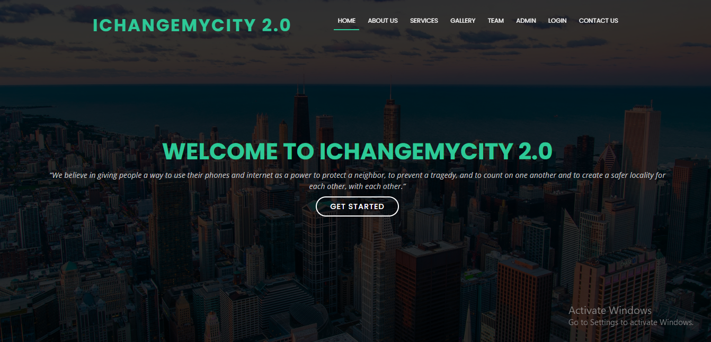

# Team-16 HEXception
# NGO - JANAAGRAHA
# ichangemycity 🌳

# Challenge Statement-
An issue reporting system that could be included in the current platform for user to post the issue by simply sending a text. This is not possible right now because the user needs to identify the category of the issue for the NGO to further process it. Currently, there are more than 100 categories that the user can choose the issue from and it is not simple to display more than 100 Categories. A few examples of the issue category woule be ‘Garbage dump on the road’, ‘Street light issue’, ‘Public toilet not being clean’, ‘Potholes’ etc.
This process can be made easier if the description posted by the user is analysed, and through a machine learning algorithm, the system can identify the category to which the issue belongs to.
Key Features :
1. Inclusion of an interface in the current mobile application of Change My City which would allow raising a complaint with a simple text message.
2. A machine learning system which can identify the nature and category of the issue posted.

## Website Frontend- 🖌
  
    <h3 align="center"></h3>
     
    
     

### Tools used-🛠️
Bootstrap (https://getbootstrap.com/)

## Modelling
 
    <h3 align="center"></h3>
     
    
     
### Tools and Technologies used- :🛠️
* Machine Learning
* Platform- Juypter
* Pandas library
* Scikit learn
* TFIDF vectorizers

## App- 📴
### Tools and Technilogies used-🛠️
* Dialogue flow
* Android
* Java Language

## References

